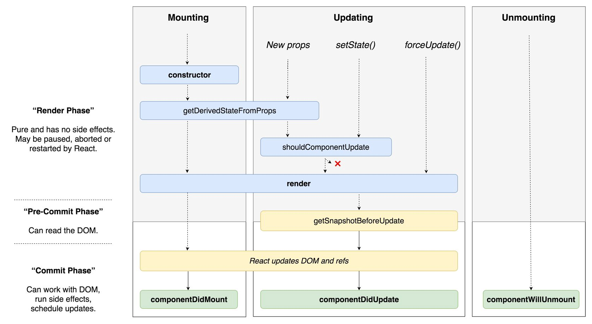

> ## 컴포넌트를 표현하는 JSX
    
JSX는 Javasrcipt XML의 줄임말로 자바스크립트에 XML을 추가한 확장형 문법으로 이해하면 된다.  
리액트 엔진은 JSX의 XML 구조를 분석하여 자바스크립트 함수 코드로 변환한다.
리액트를 사용하면 개발자는 JSX만 작성하고, 리액트 엔진은 JSX를 기존 자바스크립트로 해석하는 역할만 하면 된다. 이것을 선언형 화면 기술이라고 부른다.

> ## 컴포넌트 생명주기

### ✔️ constructor(props) 함수
맨 처음에 생성될 때 한번만 호출되며, 상태를 선언할 때 사용된다.
constructor() 함수를 정의할 때는 항상 super() 함수를 가장 위에 호출해야 한다.
super() 함수에는 프로퍼티와 생명주기 상태 등을 초기화하는 중요한 과정을 포함하고 있기 때문이다.

### ✔️ render() 함수
render() 함수는 데이터가 변경되어 새 화면을 그려야할 때 자동으로 호출되는 함수이다. 
render() 함수가 반환하는 JSX를 화면에 그려준다.

### ✔️ static getDerivedStateFromProps(props, state) 함수
getDerivedStateFromProps() 함수는 정적함수이다. 따라서 함수 안에서 this.props나 this.state 와 같은 방법으로 프로퍼티나 state값에 접근할 수 없다. 이 함수는 상위 컴포넌트에서 전달받은 프로퍼티로 state 값을 연동할 때 주로 사용되며, 반환값으로 state를 변경한다.

### ✔️componentDidMount() 함수
componentDidMount() 함수는 render() 함수가 JSX를 화면에 그린 이후에 호출되는 함수이다. 

### ✔️ shouldComponentUpdate(nextProps, nextState) 함수
shouldComponentUpdate() 함수는 프로퍼티를 변경하거나 setState() 함수를 호출하여 state 값을 변경하면 '화면을 새로 출력해야 하는지' 판단하는 함수이다.
이 함수는 화면을 새로 출력할지 말지 판단하며, 데이터 변화를 비교하는 작업을 포함하므로 리액트 성능에 영향을 많이 준다. 화면 변경을 위해 검증 작업을 해야 하는 경우, 이 함수를 사용하면 됩니다. forceUpdate() 함수를 호출하여 화면을 출력하면 이 함수는 호출되지 않는다.

### ✔️ getSnapshotBeforeUpdate(prevProps, prevState) 함수
getSnapshotBeforeUpdate() 함수는 컴포넌트가 실제 화면에 출력된 이후 호출되는 함수이다. 이 함수는 부모 컴포넌트로부터 전달된 이전 프로퍼티(prevProps)와 이전 state값(prevState)과 함께 getSnapshotBeforeUpdate() 함수에서 반환된 값(snapshot)을 인자로 전달받는다. 이 값들을 이용하여 스크롤 위치를 옮기거나 커서를 이동시키는 등의 DOM 정보를 변경할 때 사용된다.

### ✔️ componentWillUnmount() 함수
componentWillUnmount() 함수는 컴포넌트가 소멸되기 직전에 호출되는 함수다. 보통 컴포넌트에서 감시하고 있는 작업들을 해제할 때 필요한 함수이다. 예를 들어 컴포넌트에 setInterval() 함수가 사용되었다면 이 함수에서 setInterval() 함수를 clearInterval() 함수로 해제해야 한다. 이러한 해제 작업이 생략되면 메모리 누수 현상이 발생하여 웹 브라우저의 작동이 멈추기도 한다.

> ## 클래스형 컴포넌트

### ✔️ PureComponent 알아보기
PureComponent 클래스는 component 클래스를 상속받은 클래스이다. PureComponent 클래스는 shouldComponentUpdate() 함수를 얕은 비교를 하도록 재정의 했다. 즉, PureComponent 클래스로 만들어진 컴포넌트는 얕은 비교를 통해 데이터가 변경된 경우에만 render() 함수를 호출하여 데이터의 변경이 있으면 화면을 새로 출력한다. 반면 Component 클래스로 만들어진 컴포넌트는 항상 render() 함수를 호출하여 항상 화면을 새로 출력한다.

> ## 함수형 컴포넌트
함수형 컴포넌트는 조금 길게 표현하여 state가 없는 함수형 컴포넌트라고 부른다. 이름에서 알 수 있듯 함수형 컴포넌트는 state를 포함하지 않으며 데이터를 받아 출력할 컴포넌트를 반환한다.  
함수형 컴포넌트에는 클래스 선언이 없이 상위 컴포넌트로부터 전달받은 프로퍼티와 컨텍스트만을 이용하여 화면으르 구성한다. 그리고 함수형 컴포넌트는 state와 생명주기 함수를 사용할 수 없다. 그래서 함수형 컴포넌트는 단순한 구조의 UI 컴포넌트를 제작할 때 많이 사용된다.

> ## 컴포넌트에서 콜백 함수와 이벤트 처리하기
리액트는 프로퍼티, state와 같은 데이터를 상위 컴포넌트에서 하위 컴포넌트 방향으로 전달한다. 만약 데이터 변경이 필요한 경우 콜백 함수를 호출하여 원본 데이터가 위치한 상위 컴포넌트에서 데이터를 변경하고 다시 자식 컴포넌트로 전달하도록 만든다.